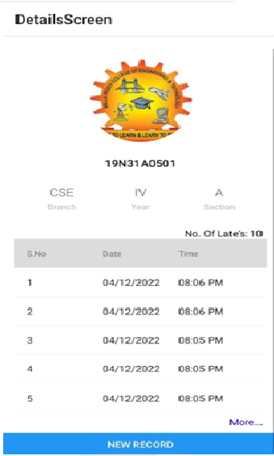

# 📱 Student-Activity-Manager-App
It is a Mobile App used to scan the ID Cards of students who come late to college and store their entry records in a database. It also displays the history of late entries for each student.
 

### 🚀 Features

- 🔍 ID Card Scanning – Quickly scan student ID cards using the device camera.
- 📦 Database Integration – Automatically logs and stores late entry records.
- 📄 Student History View – View a list of previous late arrivals for a specific student.
- 📱 Mobile-First Design – Built with React Native for smooth cross-platform use.
 

### 🛠️ Installation

- run `npm install` or `yarn install`
 

### 📲 Run on Device

- run `npm start` or `yarn start`
- Make sure a mobile emulator is running or connect a physical device with debugging enabled.
 

### 🖼️ Screenshots

### 📦 Tech Stack

- React Native  
- Expo  
- Firebase / SQLite  
- Camera & QR Code Scanning Libraries  
 

### 👥 Contributors

- Narendra Kumar

### **Contact **
- email : naren.v487@gmail.com
