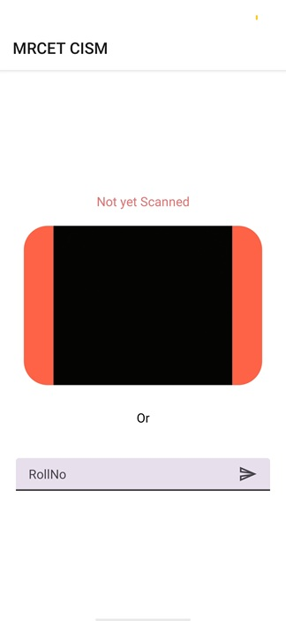
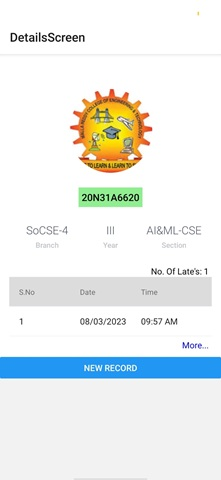
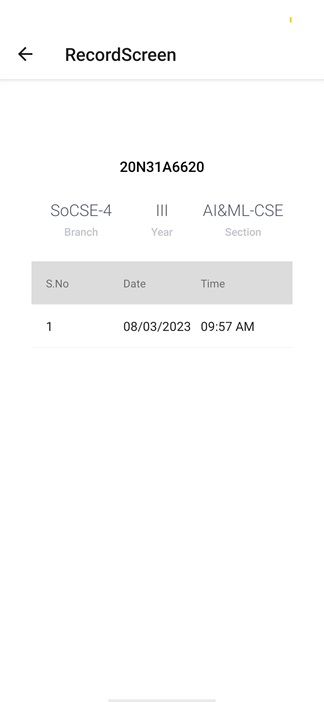

# Student-Activity-Manager-App
It is an Mobile App which is used for scan the Id Cards of students who came late to college and Stores the record in the Database.it also shows the list of late Coming records of a particular Student
 
### Installation

- run `npm install` or `yarn install`

### Run on Device

- run `npm start` 
### Screenshots

### **Contact **
- email : techne487@gmail.com
